# Generación procedural e integración del modelo digestivo

## Propósito

Este documento explica cómo el proyecto genera la gallina y sus órganos, cómo transforma esa geometría en archivos GLB, cómo Unity relaciona cada malla con sus datos científicos y cómo el resultado termina publicado como WebGL.

La geometría actual es una representación educativa reproducible. Está marcada como `schematic_pending_validation`: técnicamente está integrada y validada, pero sus proporciones todavía deben ser revisadas por un especialista en anatomía aviar antes de considerarse definitivas.

## Índice

1. [Vista general](#vista-general)
2. [Archivos y responsabilidades](#archivos-y-responsabilidades)
3. [Convenciones fundamentales](#convenciones-fundamentales)
4. [Generador de Blender](#generador-de-blender)
5. [Cómo se construye cada órgano](#cómo-se-construye-cada-órgano)
6. [Ensamblaje y exportación](#ensamblaje-y-exportación)
7. [Validación automática](#validación-automática)
8. [Integración en Unity](#integración-en-unity)
9. [Relación entre geometría, datos y simulación](#relación-entre-geometría-datos-y-simulación)
10. [Build WebGL y publicación](#build-webgl-y-publicación)
11. [Cómo modificar o agregar componentes](#cómo-modificar-o-agregar-componentes)
12. [Diagnóstico de problemas](#diagnóstico-de-problemas)
13. [Comandos de trabajo](#comandos-de-trabajo)

## Vista general

El sistema mantiene separadas cuatro responsabilidades:

- **Blender/Python:** genera la geometría y exporta los modelos.
- **JSON:** define identidad, orden digestivo, procesos, fichas y referencias.
- **Unity/C#:** carga los datos y modelos, los enlaza por identificador y agrega interacción.
- **WebGL/GitHub Pages:** empaqueta y publica la aplicación para navegador.

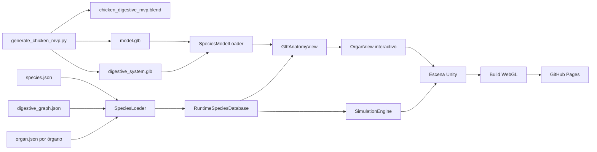

La unión entre la parte visual y la parte científica no depende del texto visible. Depende de IDs estables como `gizzard`, `duodenum` o `liver`.

## Archivos y responsabilidades

| Archivo o carpeta | Responsabilidad |
|---|---|
| `Blender/generate_chicken_mvp.py` | Genera exterior, órganos, materiales, metadatos, `.blend` y GLB. |
| `Blender/chicken_digestive_mvp.blend` | Fuente Blender resultante y editable manualmente. |
| `Blender/validate_chicken_mvp.py` | Reimporta los GLB y verifica nombres, calidad, detalle, compactación y continuidad. |
| `Blender/render_preview.py` | Produce dos imágenes de revisión: gallina transparente y órganos aislados. |
| `UnityProject/.../species/chicken/model.glb` | Envolvente exterior de la gallina. |
| `UnityProject/.../species/chicken/digestive_system.glb` | Los 19 órganos seleccionables. |
| `UnityProject/.../species/chicken/species.json` | Declara los archivos de modelo, escala y lista oficial de órganos. |
| `UnityProject/.../species/chicken/digestive_graph.json` | Declara el recorrido, procesos y órganos accesorios. |
| `UnityProject/.../organs/<id>/organ.json` | Ficha científica de cada órgano. |
| `SpeciesModelLoader.cs` | Carga ambos GLB con glTFast en escritorio y WebGL. |
| `GltfAnatomyView.cs` | Busca las mallas por ID, repara materiales y las vuelve interactivas. |
| `OrganView.cs` | Conserva la definición del órgano y controla sus colores de selección/simulación. |
| `AnatomySchematicBuilder.cs` | Crea primitivas de respaldo si el GLB tarda o falla. |
| `SimulationEngine.cs` | Convierte el grafo digestivo y el perfil alimentario en etapas reproducibles. |
| `WebGlBuild.cs` | Configura materiales y genera `WebGLBuild/`. |
| `Tools/prepare-github-pages.mjs` | Prepara los archivos comprimidos para un host estático. |
| `.github/workflows/pages.yml` | Publica automáticamente la rama `main` en GitHub Pages. |

## Convenciones fundamentales

### Identificadores

El mismo ID debe aparecer, sin traducción ni variaciones, en cuatro lugares:

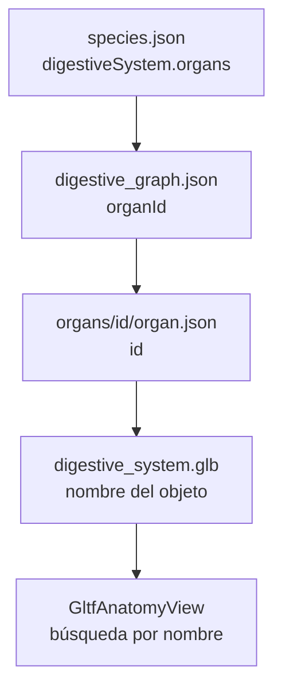

Ejemplo para la molleja:

| Capa | Valor esperado |
|---|---|
| Lista de órganos | `gizzard` |
| Nodo del grafo | `"organId": "gizzard"` |
| Ficha | `"id": "gizzard"` |
| Objeto GLB | `gizzard` |
| Clave interna de Unity | `gizzard` |

Si una sola capa usa un nombre diferente, Unity no podrá enlazar el órgano y mostrará un error de carga.

### Coordenadas y escala

| Elemento | Convención |
|---|---|
| Unidad de Blender | Métrica; `scale_length = 1.0`. |
| Escala del módulo | `species.model.scale`, actualmente `1.0`. |
| X | Izquierda/derecha del cuerpo. |
| Y | Eje longitudinal; valores negativos se aproximan a cabeza/pecho y positivos a región caudal. |
| Z | Altura. |
| Envolvente automática del torso | X `[-0.65, 0.65]`, Y `[-0.75, 0.95]`, Z `[0.45, 2.25]`. |

La exportación usa `export_yup=True`. Blender convierte la orientación al convenio Y-up de glTF, y glTFast la interpreta al crear los objetos de Unity.

### Densidad geométrica

| Constante | Valor | Uso |
|---|---:|---|
| `ORGAN_SPHERE_SEGMENTS` | 64 | Segmentos horizontales mínimos de órganos redondeados. |
| `ORGAN_SPHERE_RINGS` | 48 | Anillos verticales mínimos. |
| `ORGAN_CURVE_RESOLUTION` | 10 | Resolución longitudinal predeterminada de tubos digestivos. |
| `ORGAN_BEVEL_RESOLUTION` | 6 | Suavidad predeterminada de la sección transversal. |
| Límite automático digestivo | 120.000 triángulos | Se aplica al GLB digestivo completo. |
| Límite automático exterior | 120.000 triángulos | Se aplica por separado al GLB exterior. |

El modelo actual utiliza 105.976 triángulos digestivos y 7.196 exteriores. Quedan aproximadamente 14.024 triángulos disponibles dentro del límite digestivo automático.

## Generador de Blender

### Secuencia principal

La función `main()` es el punto de entrada.

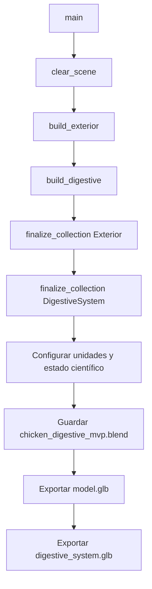

`clear_scene()` elimina objetos y colecciones de ejecuciones anteriores. Luego crea exactamente dos colecciones:

- `Exterior`: silueta, alas, cabeza, patas y cola.
- `DigestiveSystem`: los 19 objetos enlazables con las fichas.

Esta limpieza vuelve el proceso reproducible: ejecutar el script dos veces no duplica órganos.

### Funciones geométricas generales

| Función | Entrada principal | Resultado | Cuándo se usa |
|---|---|---|---|
| `material()` | Nombre, RGB, alfa, metalizado y rugosidad | Material Principled BSDF | Todos los componentes. |
| `move_to_collection()` | Objeto y colección | Objeto movido sin duplicar enlaces | Primitivas creadas por operadores de Blender. |
| `ellipsoid()` | Posición, escala, material, segmentos y anillos | Esfera UV escalada | Órganos todavía esquemáticos y partes exteriores. |
| `build_profiled_mesh()` | Perfil matemático, segmentos radiales y longitudinales | Superficie cerrada por anillos | Buche y proventrículo. |
| `tube()` | Puntos, radio, multiplicadores y tangentes | Tubo Bézier convertido a malla | Esófago, intestino, conductos y conexiones. |
| `cone()` | Posición, escala y rotación | Cono de 16 lados | Pico exterior y plumas de cola. |
| `join()` | Lista de objetos | Una sola malla con un solo nombre | Lóbulos, pares y regiones que deben compartir `organId`. |
| `finalize_collection()` | Colección y rol | Mallas normalizadas para GLB | Exterior y aparato digestivo. |
| `export_collection()` | Colección y ruta | Archivo GLB binario | Exportación final. |

### Cómo funciona `build_profiled_mesh()`

Esta función recibe otra función llamada `profile(t)`, donde `t` avanza de `0` a `1`. Para cada valor, el perfil devuelve:

```text
centro_x, centro_y, z, radio_x, radio_y
```

El generador crea un anillo elíptico en cada altura, conecta anillos vecinos mediante caras cuadrangulares y cierra ambos extremos.

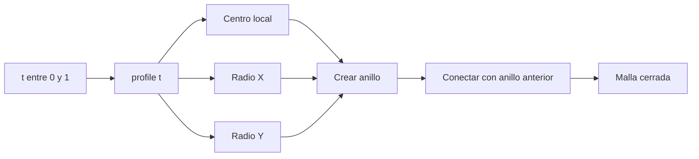

El perfil puede desplazar el centro y variar los dos radios independientemente. Por eso produce formas asimétricas y no solamente cápsulas.

Conceptualmente, cada vértice de un anillo se calcula así:

```text
x = centro_x + cos(ángulo) × radio_x
y = centro_y + sin(ángulo) × radio_y
z = altura_del_perfil
```

Después se aplican `location`, `scale` y `rotation` al objeto completo.

### Cómo funciona `tube()`

`tube()` crea una curva Bézier tridimensional, asigna un grosor y la convierte en malla.

| Parámetro | Función |
|---|---|
| `points` | Centros por donde pasa el órgano. |
| `radius` | Grosor base. |
| `radii` | Multiplicador de grosor por punto; permite ensanchar o afinar. |
| `tangent_scale` | Controla la longitud de tangentes explícitas y la suavidad del recorrido. |
| `curve_resolution` | Subdivisiones entre puntos. |
| `bevel_resolution` | Redondez de la sección transversal. |
| `cyclic` | Une final e inicio si se requiere un circuito cerrado. |

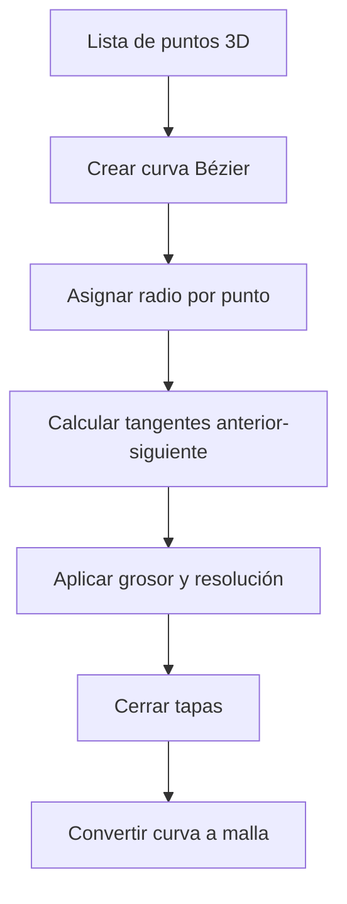

Una lista `radii=[0.8, 1.0, 1.1, 0.2]` significa que el tubo inicia estrecho, alcanza su grosor normal, se ensancha y termina afinado. El número de radios debe coincidir exactamente con el número de puntos.

### Deformación con BMesh

Los órganos que necesitan controlar cada vértice usan BMesh:

- `build_gizzard_mesh()` deforma una esfera para formar un disco muscular biconvexo con cinturón ecuatorial.
- `build_liver_lobe()` afina el borde ventral y agrega relieve visceral y escotadura craneal.
- `build_cloaca_region()` modifica cada cámara para evitar tres esferas perfectas idénticas.

El patrón es:

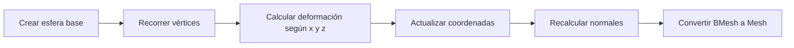

### Unión de componentes

Algunos órganos se construyen con varias piezas y después se unen:

| Órgano final | Componentes antes de `join()` |
|---|---|
| `salivary_glands` | Glándula izquierda y derecha. |
| `gizzard` | Cuerpo muscular, cuello de entrada y cuello de salida. |
| `pancreas` | Núcleo curvo y cuatro lóbulos glandulares. |
| `liver` | Lóbulo izquierdo y derecho. |
| `ceca` | Ciego izquierdo y derecho. |
| `cloaca` | Coprodeo, urodeo y proctodeo. |

`join()` conserva materiales múltiples, pero el resultado recibe un solo nombre. Esto permite que la cloaca muestre tres colores y siga funcionando como una sola ficha seleccionable.

## Cómo se construye cada órgano

### Vista del resultado actual

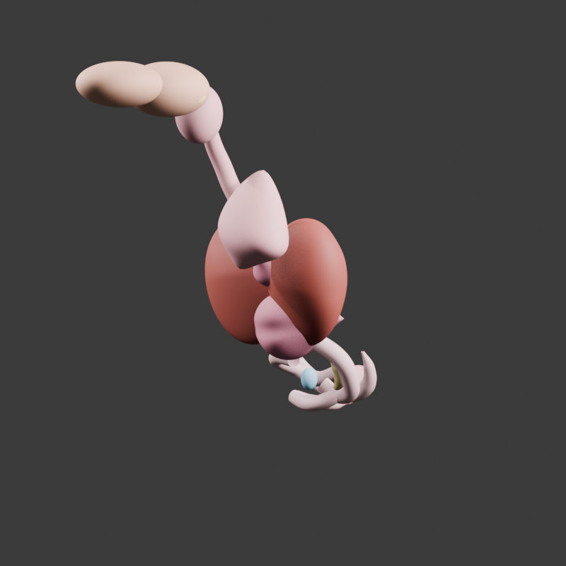

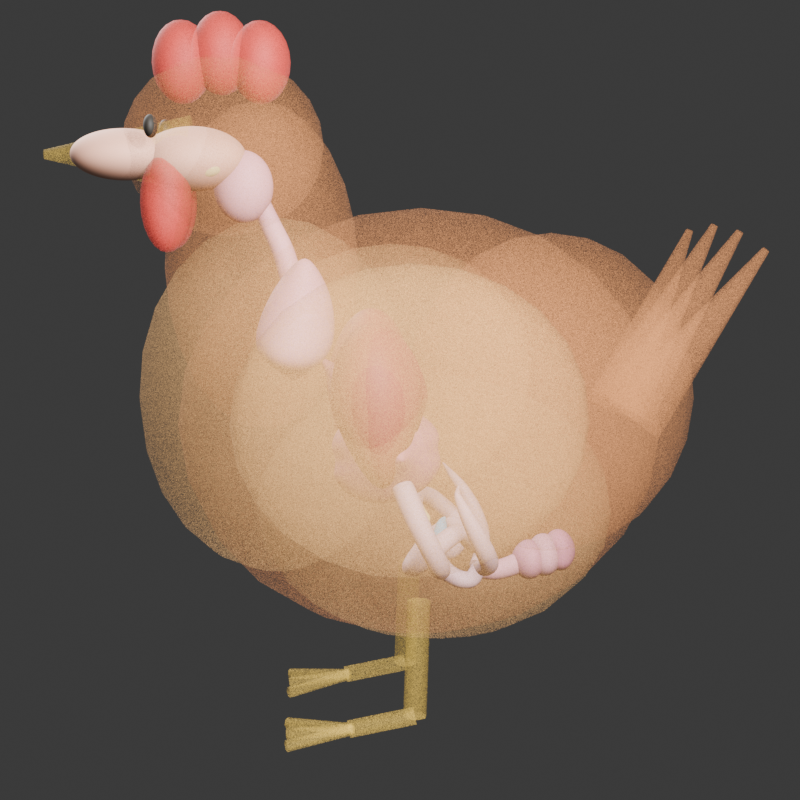

### Inventario actual

| `organId` | Método geométrico | Rasgo representado | Triángulos |
|---|---|---|---:|
| `beak` | Elipsoide UV | Entrada oral interna | 6.016 |
| `oral_cavity` | Elipsoide UV | Cavidad oral | 6.016 |
| `tongue` | Elipsoide aplanado | Lengua | 6.016 |
| `salivary_glands` | Dos elipsoides unidos | Par glandular | 12.032 |
| `pharynx` | Elipsoide | Transición orofaríngea | 6.016 |
| `esophagus` | Tubo Bézier | Conducto cervical continuo | 1.308 |
| `crop` | Perfil longitudinal | Dilatación lateral dependiente | 6.016 |
| `proventriculus` | Perfil fusiforme | Estómago glandular | 4.368 |
| `gizzard` | BMesh más dos cuellos | Disco muscular biconvexo | 7.464 |
| `duodenum` | Tubo Bézier de alta resolución | Asa descendente y ascendente | 9.548 |
| `pancreas` | Núcleo tubular más cuatro lóbulos | Glándula alargada dentro del asa | 6.196 |
| `liver` | Dos lóbulos BMesh | Hígado aviar bilobulado | 11.008 |
| `biliary_tract` | Tubo Bézier fino | Conexión hepatoduodenal | 668 |
| `jejunum` | Tubo Bézier con 17 puntos | Asas intestinales irregulares | 6.944 |
| `ileum` | Tubo Bézier afinado | Tramo distal a unión ileocecal | 2.192 |
| `meckels_diverticulum` | Rama tubular ciega | Hito yeyuno-ileal | 1.328 |
| `ceca` | Dos tubos largos unidos | Ciegos pares con extremos afinados | 6.112 |
| `colon` | Tubo corto ensanchado | Recuperación de agua y tránsito | 1.760 |
| `cloaca` | Tres cámaras BMesh unidas | Coprodeo, urodeo y proctodeo | 4.968 |
| **Total digestivo** | 19 objetos | Un objeto por ID oficial | **105.976** |

### Bloques anatómicos implementados

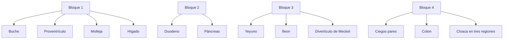

### Ruta anatómica principal

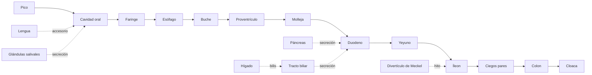

## Ensamblaje y exportación

### Normalización antes del GLB

`finalize_collection()` ejecuta estas operaciones en cada malla:

1. Aplica rotación y escala.
2. Valida la estructura interna de la malla.
3. Recalcula normales hacia afuera.
4. Activa sombreado suave.
5. Genera UV mediante `smart_project` si faltan.
6. Centra el pivote en los límites del objeto.
7. Agrega metadatos `asset_role` y `scientific_status`.
8. Agrega `organ_id` a todos los órganos digestivos.

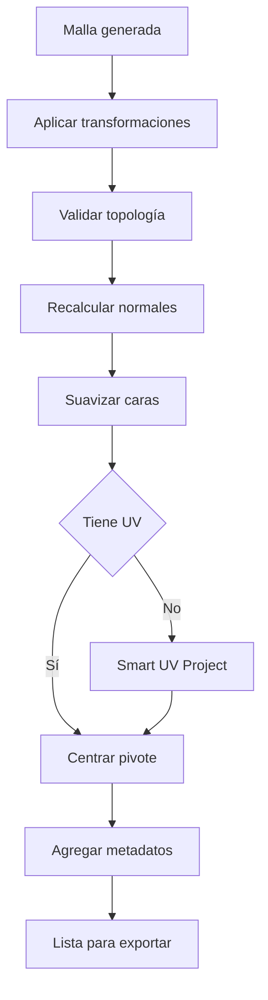

### Metadatos importantes

| Propiedad GLB | Ejemplo | Uso |
|---|---|---|
| `asset_role` | `digestive_organ` | Diferencia exterior de órganos. |
| `scientific_status` | `schematic_pending_validation` | Evita presentar el modelo como validado. |
| `organ_id` | `duodenum` | Identidad estable del órgano. |
| `procedural_form` | `descending_ascending_u_loop` | Documenta la intención geométrica. |
| `anatomical_relation` | `encloses_pancreas...` | Describe relación espacial prevista. |
| `surface_features` | `four_overlapping_glandular_lobules` | Resume rasgos de superficie. |

### Dos GLB separados

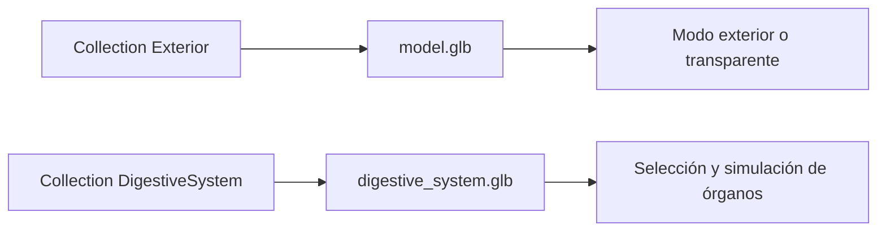

La separación permite ocultar completamente el cuerpo sin ocultar los órganos y ajustar la transparencia exterior sin modificar sus materiales internos.

## Validación automática

`validate_chicken_mvp.py` no confía en la escena abierta. Borra su escena, reimporta los dos GLB exportados y valida lo que Unity realmente recibirá.

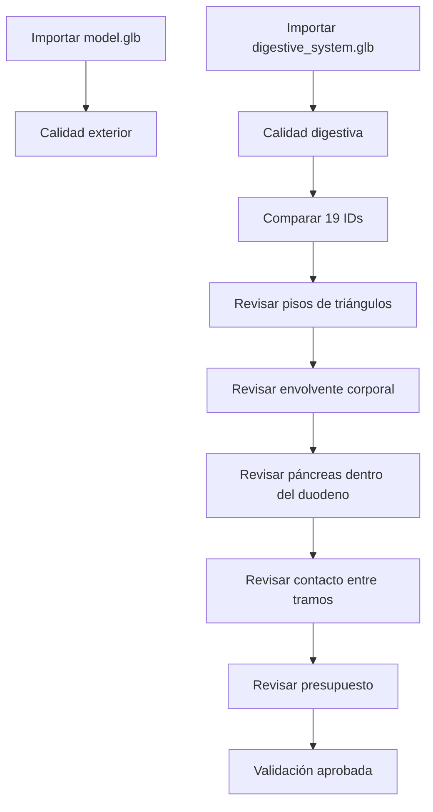

### Controles por malla

| Control | Motivo |
|---|---|
| Escala igual a `(1,1,1)` | Evita diferencias de tamaño inesperadas al importar. |
| Al menos un material | Evita mallas magenta o invisibles. |
| Al menos un mapa UV | Permite materiales y texturas futuras. |
| Normales válidas | Evita caras oscuras o invisibles. |
| Pivote dentro de límites | Mejora enfoque de cámara y selección. |

### Pisos de detalle

El diccionario `REMODELED_MIN_TRIANGLES` impide que un órgano remodelado vuelva accidentalmente a una primitiva demasiado simple.

| Órgano | Piso automático |
|---|---:|
| Buche | 5.000 |
| Proventrículo | 4.000 |
| Molleja | 7.000 |
| Hígado | 10.000 |
| Duodeno | 6.000 |
| Páncreas | 4.000 |
| Yeyuno | 5.000 |
| Íleon | 1.500 |
| Divertículo de Meckel | 800 |
| Ciegos | 5.000 |
| Colon | 1.500 |
| Cloaca | 4.000 |

### Continuidad espacial

`require_bounds_contact()` calcula la caja envolvente mundial de dos órganos. Considera que hay continuidad si las cajas se tocan o quedan separadas por menos de `0.025` unidades.

Las relaciones controladas son:

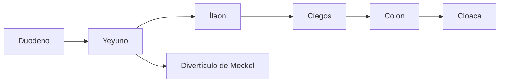

Este control detecta separaciones grandes. No sustituye una revisión anatómica ni garantiza una unión topológica soldada entre mallas independientes.

## Integración en Unity

### Carga del modelo

`SpeciesModelLoader.Load()` recibe `SpeciesDefinition` y ejecuta dos cargas asíncronas con glTFast.

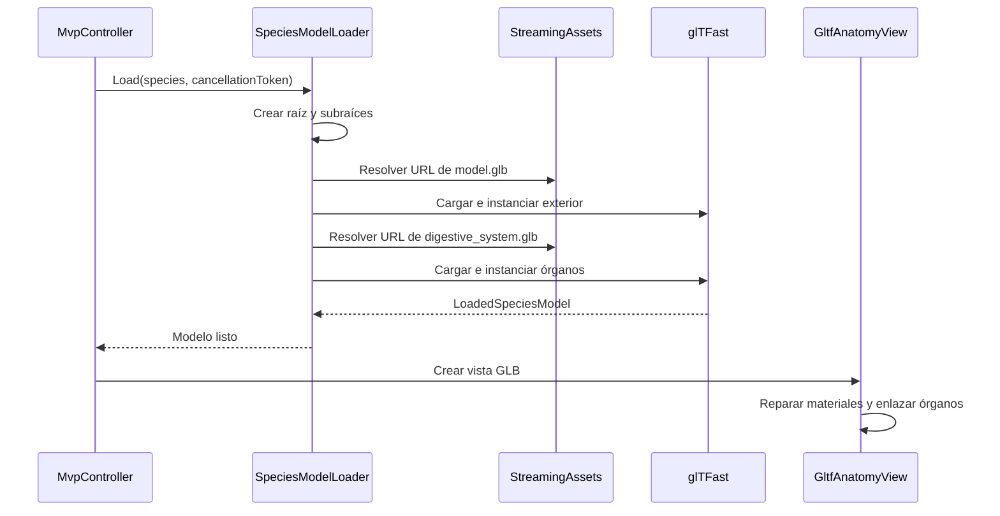

La raíz creada tiene esta jerarquía:

```text
LoadedModel_chicken
├── Exterior
│   └── objetos de model.glb
└── DigestiveSystem
    └── 19 objetos de digestive_system.glb
```

### Rutas locales y web

`ModelUrl()` usa `Application.streamingAssetsPath` y `StreamingAssetClient.Join()`.

- En escritorio, convierte una ruta absoluta a URI `file:///...`.
- En WebGL, conserva la URL HTTP generada por Unity.
- Por eso los mismos `species.json` y GLB funcionan localmente y en GitHub Pages.

### Modelo de respaldo

Unity no deja la pantalla vacía mientras carga el GLB:

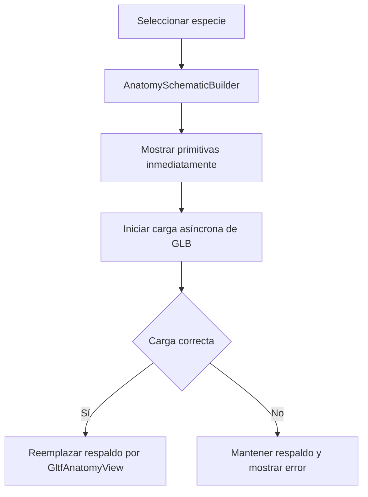

`AnatomySchematicBuilder` usa cápsulas para el trayecto, esferas para accesorios y cubos para ramificaciones. No es el modelo definitivo; garantiza que la navegación siga funcionando ante un fallo de red o de importación.

### Enlace de órganos

`GltfAnatomyView.BindOrgans()` recorre la lista oficial de `species.digestiveSystem.organs`. Para cada ID:

1. Busca un `Transform` del GLB con el mismo nombre, ignorando mayúsculas.
2. Localiza su `Renderer`.
3. Cambia el nombre del objeto anfitrión al `organId` oficial.
4. Agrega `MeshCollider` cuando existe una malla; usa `BoxCollider` como respaldo.
5. Agrega o reutiliza `OrganView`.
6. Obtiene la ficha desde `RuntimeSpeciesDatabase`.
7. Registra el órgano en el diccionario `views`.

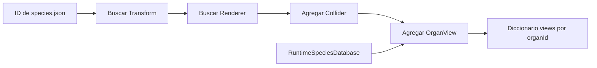

### Materiales y prevención del color magenta

`GltfAnatomyView.RepairUnsupportedMaterials()` inspecciona los shaders importados. Si un material no está soportado o usa `Hidden/InternalErrorShader`, crea un reemplazo a partir de recursos incluidos en el build.

| Recurso | Uso |
|---|---|
| `GltfOpaqueDouble` | Órganos opacos, renderizados por ambos lados. |
| `GltfTransparentDouble` | Exterior transparente, sin escritura de profundidad. |
| `UrpLit` | Respaldo para materiales iluminados. |
| `UrpUnlit` | Respaldo para elementos sin iluminación. |

`WebGlBuild.PrepareBuildSupportMaterials()` crea o actualiza estos materiales antes de compilar, evitando que Unity los elimine por optimización.

### Modos de visibilidad

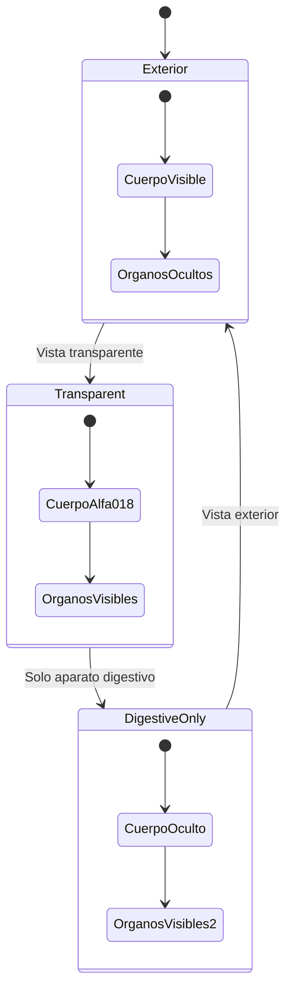

### Selección y color

`OrganView` mantiene tres estados visuales:

| Estado | Color |
|---|---|
| Normal | Color base distribuido por HSV. |
| Seleccionado | Amarillo. |
| Etapa activa de simulación | Cian. |

El estado de simulación tiene prioridad sobre la selección. El color se escribe en cualquiera de las propiedades compatibles: `baseColorFactor`, `_BaseColor` o `_Color`.

### Cámara

`OrbitCameraController` calcula límites usando todos los `Renderer` bajo la raíz.

| Entrada | Acción |
|---|---|
| Botón izquierdo o derecho | Girar. |
| Rueda | Acercar o alejar. |
| Botón central | Desplazar encuadre. |
| `Shift` más botón izquierdo/derecho | Desplazar encuadre. |
| Seleccionar órgano | `Focus()` centra y ajusta distancia. |
| Recentrar | `ResetView()` restaura ángulos y encuadre general. |

Los límites de la interfaz se excluyen del área interactiva para que arrastrar un panel no gire accidentalmente el modelo.

## Relación entre geometría, datos y simulación

### Tres estructuras diferentes

| Estructura | Pregunta que responde |
|---|---|
| GLB | ¿Qué forma y material tiene el órgano? |
| `organ.json` | ¿Qué información científica se muestra? |
| `digestive_graph.json` | ¿En qué orden participa y qué proceso realiza? |

Cambiar la malla no modifica la ficha científica. Cambiar la ficha no modifica el recorrido. Cambiar el grafo no altera la forma. Se conectan únicamente mediante `organId`.

### Generación del plan de simulación

`SimulationEngine.BuildPlan()` recorre el grafo desde `entryNodeId` usando una cola y evita ciclos con `visited`.

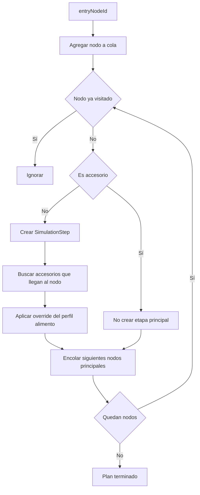

Los órganos accesorios no se convierten en estaciones del bolo, pero se agregan como contribuyentes:

| Etapa principal | Accesorios contribuyentes |
|---|---|
| Cavidad oral | Lengua y glándulas salivales. |
| Duodeno | Páncreas, hígado y tracto biliar. |
| Íleon | Divertículo de Meckel como hito accesorio según el grafo. |

### Máquina de estados

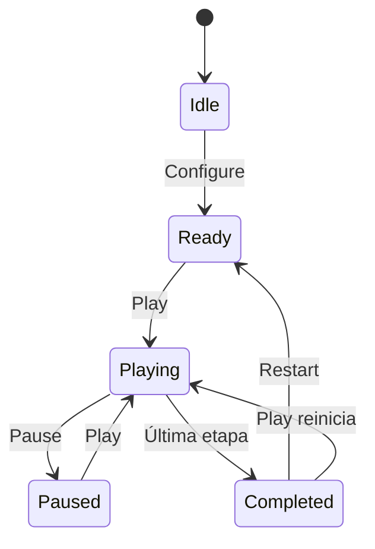

Cada `SimulationStep` contiene:

- nodo e `organId`;
- tipo de proceso;
- órganos accesorios;
- duración;
- mensaje específico del alimento;
- archivo de audio.

## Build WebGL y publicación

### Compilación local

`WebGlBuild.Build()` realiza lo siguiente:

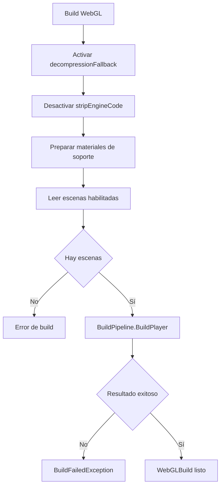

`stripEngineCode = false` conserva componentes creados dinámicamente, especialmente `AudioSource`, colliders y primitivas de respaldo.

### Preparación para GitHub Pages

GitHub Pages no permite configurar libremente `Content-Encoding`. `prepare-github-pages.mjs` crea una carpeta publicable con archivos expandidos y actualiza `index.html`.


### Publicación automática

```mermaid
sequenceDiagram
    participant Dev as Repositorio local
    participant GH as GitHub main
    participant AC as GitHub Actions
    participant PG as GitHub Pages

    Dev->>GH: git push
    GH->>AC: Activar pages.yml
    AC->>AC: Checkout
    AC->>AC: Preparar _site
    AC->>AC: Subir artefacto
    AC->>PG: Deploy
    PG-->>Dev: Sitio público actualizado
```

## Cómo modificar o agregar componentes

### Cambiar la trayectoria de un tubo

Ejemplo conceptual:

```python
tube(
    "organ_id",
    [(x1, y1, z1), (x2, y2, z2), (x3, y3, z3)],
    0.05,
    material,
    collection,
    radii=[0.8, 1.0, 0.2],
    tangent_scale=0.16,
    curve_resolution=12,
    bevel_resolution=7,
)
```

Reglas:

1. Mantener igual cantidad de `points` y `radii`.
2. Usar el primer y último punto para coincidir con órganos vecinos.
3. Evitar tangentes demasiado largas en curvas compactas.
4. Afinar un extremo ciego con un radio final cercano a `0.08`.
5. Volver a ejecutar generación, validación y render.

### Crear un órgano por perfil

Se recomienda un perfil cuando el órgano tiene un eje reconocible y su grosor cambia de forma compleja.

```python
def organ_profile(t):
    envelope = math.sin(math.pi * t) ** 0.7
    bulge = math.exp(-((t - 0.5) / 0.25) ** 2)
    return 0.0, 0.0, -1.0 + 2.0 * t, envelope * (0.5 + bulge), envelope * 0.7
```

Luego se pasa a `build_profiled_mesh()`. `t=0` y `t=1` deben producir extremos coherentes y sin radios negativos.

### Crear un órgano con varias piezas

```mermaid
flowchart LR
    A[Crear pieza 1] --> D[join con organId final]
    B[Crear pieza 2] --> D
    C[Crear pieza 3] --> D
    D --> E[Un objeto seleccionable]
```

El primer objeto de la lista se convierte en el objeto activo y recibe el nombre final. Si las piezas usan materiales distintos, se conservan como ranuras de material de la malla unida.

### Agregar un órgano nuevo al sistema

No basta con dibujarlo. Debe integrarse en todas las capas:

| Paso | Cambio |
|---:|---|
| 1 | Elegir un ID estable, en minúsculas y sin espacios. |
| 2 | Generar una malla con ese nombre. |
| 3 | Agregar el ID a `species.json`. |
| 4 | Crear `organs/<id>/organ.json`. |
| 5 | Agregar un nodo y conexiones en `digestive_graph.json`. |
| 6 | Agregar el ID a `EXPECTED_ORGANS` del validador. |
| 7 | Definir piso de detalle si la malla ya es anatómica. |
| 8 | Regenerar, validar, renderizar y probar Unity. |

```mermaid
flowchart TD
    A[Nuevo organId] --> B[Malla Blender]
    A --> C[species.json]
    A --> D[organ.json]
    A --> E[digestive_graph.json]
    A --> F[Validador]
    B --> G[GLB]
    C --> H[Unity]
    D --> H
    E --> H
    F --> G
    G --> H
```

### Agregar otra especie

La arquitectura no requiere condicionales como `if species == chicken`.

1. Crear `species/<new-id>/species.json`.
2. Crear su grafo y fichas de órganos.
3. Producir `model.glb` y `digestive_system.glb` con objetos nombrados según sus IDs.
4. Agregar la especie a `species_catalog.json`.
5. Crear perfiles en `profiles/<new-id>/`.
6. Validar referencias y rutas de absorción.

El generador de gallina puede reutilizar sus primitivas generales, pero las funciones anatómicas específicas deben vivir en un generador propio o parametrizado.

## Diagnóstico de problemas

| Síntoma | Causa probable | Comprobación o solución |
|---|---|---|
| Unity indica que falta un órgano | El nombre GLB no coincide con `organId` | Revisar los cuatro niveles de ID y ejecutar el validador. |
| Órgano magenta | Shader eliminado o no soportado | Verificar materiales de soporte y `RepairUnsupportedMaterials()`. |
| Órgano no se puede seleccionar | No existe `Renderer`, malla o collider | Revisar `BindOrgans()` y la importación glTFast. |
| El órgano aparece fuera del cuerpo | Coordenadas o escala incorrectas | Revisar la envolvente del torso y ejecutar validación. |
| Tubo con quiebres | Pocos puntos o tangente excesiva | Ajustar puntos y `tangent_scale`. |
| Tubo con diámetro extraño | Cantidad/valores de `radii` | Usar un multiplicador por punto y evitar valores negativos. |
| Se perdió un lóbulo tras unir | Objeto no incluido en `join()` | Revisar lista y objeto activo. |
| Caras oscuras o invisibles | Normales incorrectas | Ejecutar `finalize_collection()` y validación. |
| Build demasiado pesado | Exceso de segmentos o mallas duplicadas | Revisar conteo por órgano y no añadir subdivisión redundante. |
| Funciona en Editor pero no en WebGL | Recurso eliminado por stripping o ruta no web | Conservar `stripEngineCode = false` y usar `StreamingAssets`. |
| Audio o collider desaparece en WebGL | Código dinámico eliminado | Revisar configuración de build. |
| GitHub Pages no carga `.wasm` o `.data` | Compresión sin encabezados correctos | Ejecutar `prepare-github-pages.mjs`. |
| Se ve el esquema en lugar del GLB | Falló o se canceló la carga asíncrona | Revisar mensaje de `SpeciesModelLoader.LastError`. |

## Comandos de trabajo

Ejecutar desde la raíz del repositorio.

### Regenerar Blender y GLB

```powershell
& 'C:\Program Files\Blender Foundation\Blender 5.2\blender.exe' --background --python Blender\generate_chicken_mvp.py
```

### Validar los GLB

```powershell
& 'C:\Program Files\Blender Foundation\Blender 5.2\blender.exe' --background --python Blender\validate_chicken_mvp.py
```

### Generar vistas previas

```powershell
& 'C:\Program Files\Blender Foundation\Blender 5.2\blender.exe' --background Blender\chicken_digestive_mvp.blend --python Blender\render_preview.py
```

### Comprobar runtime y datos

```powershell
dotnet run --project Tools\CompileCheck\CompileCheck.csproj --no-restore -- UnityProject\Assets\StreamingAssets\DigestiveSimulator
powershell -ExecutionPolicy Bypass -File Tools\validate-content.ps1
```

### Generar WebGL

```powershell
& 'C:\Program Files\Unity\Hub\Editor\6000.5.7f1\Editor\Unity.exe' `
  -quit `
  -projectPath '.\UnityProject' `
  -executeMethod DigestiveSimulator.Editor.WebGlBuild.Build `
  -logFile '.\UnityProject\webgl-build.log'
```

### Preparar el sitio estático

```powershell
node Tools\prepare-github-pages.mjs WebGLBuild _site
```

## Lista de control antes de publicar

- [ ] Los 19 nombres del GLB coinciden con `species.json`.
- [ ] Ninguna malla tiene escala sin aplicar.
- [ ] Todas las mallas tienen material, UV y normales válidas.
- [ ] Los órganos del torso permanecen dentro de la envolvente.
- [ ] Las transiciones espaciales pasan la validación.
- [ ] El presupuesto digestivo permanece por debajo de 120.000 triángulos.
- [ ] Las dos vistas previas fueron revisadas visualmente.
- [ ] La comprobación del runtime finaliza las 13 etapas.
- [ ] Los 44 JSON pasan el validador de contenido.
- [ ] Unity genera el build con resultado `Success`.
- [ ] `_site` contiene `.data`, `.framework.js` y `.wasm` expandidos.
- [ ] GitHub Pages responde y sirve el GLB con el mismo tamaño local.

## Resumen mental del sistema

```mermaid
flowchart TB
    subgraph Geometria[Geometría]
        P[Python] --> BL[Blender]
        BL --> GLB[GLB]
    end
    subgraph Ciencia[Datos científicos]
        SJ[species.json]
        OJ[organ.json]
        DG[digestive_graph.json]
        PF[perfil especie-alimento]
    end
    subgraph Runtime[Unity]
        LOAD[Cargadores]
        BIND[Enlace por organId]
        SIM[Simulación]
        UI[Interfaz 3D]
    end
    subgraph Publicacion[Publicación]
        WEB[Build WebGL] --> PAGE[GitHub Pages]
    end

    GLB --> LOAD
    SJ --> LOAD
    OJ --> LOAD
    DG --> SIM
    PF --> SIM
    LOAD --> BIND
    BIND --> UI
    SIM --> UI
    UI --> WEB
```

La idea esencial es: **Python define la forma, JSON define el significado y el recorrido, Unity los enlaza mediante `organId`, y WebGL los distribuye en el navegador**.
